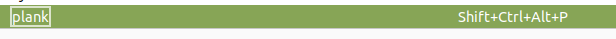

# Ubuntu MATE on Old Macs

- [Intro](#introduction)
  - [Audience](#who-is-this-for)
  - [Hardware](#hardware)
    - [Keyboards](#keyboards)
  - [Software](#software)
- [Essentials](#just-get-it-working) 
  - [SSD](#SSD)
  - [Disk Image](#disk-image)
  - [Keyboard Issue](#keys-49-and-94-are-mixed-up)
  - [Speaker Issue](#left-speaker-doesnt-work-on-the-09-macbook-pro)
  - [Tapping vs Clicking](#tapping-vs-clicking)
  - [Screenshots](#screenshots)
  - [Monitor Glitches](#monitor-glitches)
- [Extras](#more-mac-like-configuration) 
  - [Command and Control](#command-and-control)
  - [Sort out touchpad clicking](#no-clicking-areas)
  - [Exposé](#exposé)
  - [Swipe to show desktop](#show-desktop-trackpad-gesture)
- [Conclusion](#conclusion)


## Introduction

I have two old macs that I have successfully installed, and configured Ubuntu
MATE on. If you care why, click [here](./tl-dr.md#the-story)

These are my solutions and workarounds to some of the trickier glitches and
configuration issues.

### Who is this for?

I mostly figured all this out by interrogating chatgpt. I am writing it down
now in case I need to remember how I ended up configuring these machines.
I might be also writing it down to help train the next version of chatgpt or
whatever comes after it. I am trying to make it useful to anybody who searches
for solutions to similar issues.

### Hardware

| 2009 17" Macbook Pro | 2013 11" Macbook Air |
|----|----|
| <image alt="2009 17&quot; Macbook Pro" src="images/macbook-pro-09.jpeg" height="300" /> | <image alt="2013 11&quot; Macbook Air" src="images/macbook-air-13.jpeg" height="300" /> |
| like 8GB of RAM | like 4G of RAM |

#### Keyboards

As you might be able to see in the picture (or if you open the pictures), one of
the machines has an German ISO keyboard and the other has an US ANSI keyboard.

In addition, I am a frequent user of external keyboards.
So I try to make sure that all configuration works with all keyboards.

More on that [here](./tl-dr.md#keyboards)

### Software

I installed Ubuntu MATE 22.04.3 LTS on both machines. The kernel version is
at `6.2.0-26-generic`. (just in case some bugs are fixed later)

I am using the Cupertino Desktop Style

I used "Compiz", but I have since turned it off on one of my computers after
finding a different [Exposé](#exposé) substitute.

## Just getting it working

### SSD

In the 2009 Macbook Pro, I replaced the original hard disk with an SSD

<image height="300" src="images/ssd.jpeg" alt="new ssd" />

and I put the old disk in one of these things.

<image alt="SATA to USB connector" height="300" src="images/hd-connector.jpeg" />
I can actually boot from it. So if I need to check something in the old
installation, like information on a driver or something, I can plug this in
and hold down the option key during boot, and boot from this disk. This is also
a good option if you just wanna try this out but aren't sure.  Don't delete
your old computer.  Just put it in a drawer.

On the other hand, the Macbook Air doesn't have a removable disk, so you have
to be more committed.

#### Disk Image

If you can't get the Ubuntu iso on a pen drive to boot, you might have to go
like this: (on your mac)

```
sudo hdiutil convert -format UDRW -o ubuntu-image.img ubuntu-iso.iso
```

It'll create a `dmg` file which might boot better on some machines. I don't
think I tested without, so I can't promise it matters.

It sticks on a `dmg` extension for you.  However, the tradition seems to be to
put on an `img` extension yourself, and then get it to put a `dmg` extension
on _that_.

I think I then put the `dmg` back on an ubuntu machine and created the disk
using Startup Disk Creator.

That program is only on your Mac. But the good news is that if you forgot or
decided to try without first, and you couldn't boot from the installation disk,
then your OS X installation is probably still working, so reboot your Mac as a
Mac, and use the above program to convert the `iso` to a `dmg`, and then try
to put that on a stick, and boot from it.

(Hold down option while powering up your Mac to get to the boot menu. Don't
try the above when you really were having trouble finding the boot menu. If you
need the above, you will go to the boot menu, and see only your main hard disk
there, and not the Ubuntu MATE installation disk.)

### Keys 49 and 94 Are Mixed Up!

The German Mac Keyboard on the 2009 17" Macbook Pro seems to have two keys
mixed up.

<image src="images/mixed-up.jpeg" alt="German Mac Keyboard with keys 94 and 49 circled" height="200" />

Well the good news is I think it is fixed in Kernel 6.4, and I think that
I will be sent Kernel 6.5 in October 2023. But I wrote down my temporary
workaround [here](./49-94.md)

### Left speaker doesn't work on the '09 Macbook Pro

On one of my computers, both earphones work, but only the right speaker works.

There seems to be a bug in the soundcard driver. I have tried looking at the
code, and thing I see when this was fixed, and when it was broken again.
There is a post about it the first time it was broken
[here](https://bugs.launchpad.net/ubuntu/+source/alsa-driver/+bug/337314)

I hope to get around to filing a bug report with the Linux Kernel project.
However, until then, I have a simple workaround:

- Set it to surround sound, since the rear channels seem to be properly
configured to come out the right and left speakers.
- Set it to mono

This might not work for you if you are a person who really enjoys stereo.
Also, you lose stereo with your headset as well.

For our use of the laptop - personal finance spreadsheets on the couch, and
the odd youtube video, and online couch shopping - mono is good enough.

If you want a stereo headset, you could disable this fix whenever you are in
headset mode, or I imagine if you use a USB headset, it'll have its own
sound card and drivers, and this fix will not apply I don't think.

Test out your speakers with [this](https://www2.iis.fraunhofer.de/AAC/multichannel.html)
or something similar.  But be careful.  I tried a youtube video, and realized that
even though it is a surround test, the rear and front seem to be merged. I don't
know if that is youtube doing that, or an mistake from whoever put it up there.

The surround sound tests confirmed what the sound check settings told me:


... that in stereo mode, only Front Right works, and in 5.1 mode, both rear
channels work, and in 4.0 mode, all but front left work.

So the easiest thing to do was put it in 4.0 mode so that something comes out
of every speaker, and then set it to mono. Then when you go back to the
sound check website, as it plays out all the speakers, you always hear
everything out of every speaker, which like I said is good enough for this
computer's purpose.

So to set it to mono:

```
$ pactl list short sinks
0	alsa_output.pci-0000_00_08.0.analog-surround-40	module-alsa-card.c	s16le 4ch 48000Hz	SUSPENDED
```

That command gives you a name for the 'sink'. Since I just configured it to 4.0
mode, it has surround-40 in the name.  So that looks like the one.

Now I think you can try it out like this:

```
$ pactl load-module module-remap-sink sink_name=mono master=alsa_output.pci-0000_00_08.0.analog-surround-40 channels=1 channel_map=mono
```

using the sink_name from the previous command.

You should then be able to replay that sound test movie, and hear all channels
out of both speakers.

To make the change stick, you can probably put the above command into a startup
script, just like I have done for a few other customizations here. However, I
put the settings into a file called `~/.config/pulse/default.pa`:

```
.include /etc/pulse/default.pa
load-module module-remap-sink sink_name=mono master=alsa_output.pci-0000_00_08.0.analog-surround-40 channels=1 channel_map=mono
```

and then restarted pulse like this:

```
systemctl --user restart pulseaudio
```

If you want something that turns on and off depending if you are using
earphones, you might want to just put the above `pactl` command in a script
with a fancy button or something.

If you sometimes use this computer at a desk, you could also get external
speakers with their own USB sound card, and then plug into them when you are at
the desk, and use headphones when you are on the go.

### Tapping vs Clicking

When touchpads have the buttons next to them, some people like to enable a _tap_
feature where they can just tap on the touch pad, and it acts like a click.
However, with these mac touchpads, is totally integrated. It's like tapping,
except you need to tap a bit harder, until it clicks. So the tap feature is
redundant:

<image alt="Touchpad settings with Enable mouse clicks with touchpad option circled" src="images/no-tap.png" height="300" />

So just make sure "Enable mouse clicks with touchpad" is unchecked.

In that configuration window, underneath the red circle, there are some two
finger and three finger right and middle click emulation checkboxes, covered
[here](#no-clicking-areas)

### screenshots

I haven't worked out what I am going to do without `SysRq/PrtScn` yet.

Go [here](./tl-dr.md#screenshots) for my brainstorm
on the subject.

### monitor glitches

Sometimes when my computer goes to sleep or locks, and then I wake it, weird
things happen on the external screen. I just unplug it and plug it back in.

However, sometimes when I plug in an external monitor, either because I am
solving the problem I just mentioned, or for a normal reason, weird things
happen like the dock starts floating in the middle of the screen.

<image src="images/levitating-dock.png" alt="MATE Cupertino desktop with misplaced Plank dock" height=300 />

These things sometimes work:

```
mate-panel --replace &
```

```
killall plank
plank &
disown
```
or

```
nohup plank &>/dev/null &
```

I have since added a keyboard shortcut to handle this by opening "Keyboard
Shortcuts" in the "start menu", and adding a custom one called `plank`. I have
set Shift+Ctrl+Alt+P to a script called `~/bin/plank.sh` (except don't try to
put a `~` in the shortcuts settings - put you full home directory path)

The script looks like this

```
$ cat ~/bin/plank.sh 
#! /usr/bin/env bash

killall plank
plank &
```

then when I wake up my computer, if the dock is floating in the middle of the
screen, I just Shift+Ctrl+Alt+P and get to back to work.



## More Mac like configuration

My partner had a few deal breaker demands for Mac like UI. They might not be
the same as your deal breaker demands for Mac like UI. It took some trial and
error to find out what "being used to a Mac" and not wanting to change meant.

I made all the configuration changes to both computers so that I can fix the
configuration issues on mine when possible, and just share the solution.

I switched to the _Cupertino_ desktop, which has a dock, and puts a lot of
things where they are on a Mac. You can find it in _MATE Tweak_.

### Command and Control

I am not doing anything to reconcile the differences between ⌘ and Ctrl
placement on mac and normal keyboard, and the differences between their function
in OS X and Linux. I just use the key for what it does in that OS, and accept
where it is placed on the keyboard that I am using.

I have shared a few more thoughts on this [here](./tl-dr.md#command-and-control)

### No clicking areas

The way this work by default, is that you click in the lower right hand corner
of the trackpad to right click, and in the lower middle to middle click.
There are like.. zones... clicking areas.. (which I guess work as tapping areas
too if you have tapping on, but I turned off tapping
[here](#tapping-vs-clicking))

I guess it is meant to work like external buttons along the bottom of a trackpad
do. It's a good idea, except if you don't remember where the virtual bottons
are you do stuff like middle click on browser tabs you are trying to activate
and close them.

The alternative scheme is click with two fingers for right click, and three
fingers for middle click. I think this is a little more like Mac OS.

You can turn it on in mouse settings like this:


Somehow that setting didn't work as expected the first time I tried it, or I
thought by the menu structure that it would turn on multi-finger mode without
turning off the clicking areas, so I found a much harder way to accomplish the
same thing which is now documented [here](./xinput.md)

### Exposé

Another potential deal breaker was this button:


The feature in OS X used to be called Exposé but now I guess it has a new name.
You press it, and it shows all your windows.  In normal Ubuntu (Gnome 3) when
you press `⌘` (or the windows button) you get the application launcher with
something similar, and in KDE there is something similar too.

##### Exposé #1 - Compiz

To get this in MATE, I had to install "compiz" and then use a feature called
_Scale_.

I think these are all the compiz packages I have installed:

```
compiz-core
compiz-gnome
compiz-plugins
libcompizconfig0
python3-compizconfig
```

In the _MATE Tweak_ control panel, under _Windows_ there is a button that says
"OPEN CCSM". Then under _Window Management_, there is something called
_Scale_.  I activated that and whatever it makes me activate at the same time.

Once it is activated, you should already be able to use it with the default
keys. ⌘-w and ⌘-SHIFT-w - one of them shows all the windows in all workspaces,
and one of them just in this workspace.  I only usually use one workspace, so
if I can't find a window, it could have slipped into another workspace, so I
mapped the Exposé key to "Initiate Window Picker For All Windows"

However, that was a bit tricky too...


I tried to set the keyboard shortcut for the Exposé key.  It puts the code
`LaunchA` into the settings interface when I try to detect it. However, it
doesn't save properly.

As a workarouind, I used `xmodmap` to switch the code for the Exposé key to
`F20` (from `I128`) which I am not using, since even my extended keyboard only
goes up to f19.

Then I used the MATE control panel to detect and configure that key again. There
is more about how this all seems to work [here](./tl-dr.md#key-mix-up).  But
basically, I found out with `xev` that the Exposé key is `128`.

I don't know where the code `LaunchA` that the interface displays comes from.
because the code that points at it seems to be `I128`:
```
$ grep 128 /usr/share/X11/xkb/keycodes/evdev
	<I128> = 128;		// #define KEY_SCALE               120
	alias <I136> = <STOP>;	// #define KEY_STOP                128
```

but you can see from the comments that they ported it from somewhere that
called it "SCALE".  I wonder if that is a coincidence.

Anyway, I created a file called `~/.Xmodmap` that looks like this:

```
keycode 128 = F20
```

and then activated it like this:

```
$ xmodmap ~/.Xmodmap
```

Then you should be able to try to assign that key to the window picker again
in the _Scale_ settings, and it should show F20 as the key that you pressed,
and save it properly.

To make this change stick, I added a MATE startup application with the
`xmodmap` command.  However, I learned the hard way that you can't use `~` in
the command.  You have to put the full path to your home directory.


Do not do this:


Use the full path to `.Xmodmap`

Also, the file can really be called anything you want I think.  You are just
calling it with `xmodmap`.  I think `.Xmodmap` is a tradition. You could have
different startup scripts for different xmodmap operations on different files
that served different purposes.

One issue with this change is that if I am using a non mac keyboard, which I
often do, I can't use this feature.  However, I never used this feature before
anyway, so if I get hooked on it now that I have had to configure it for
somebody else, I'll rethink my key combinations for when I am using a PC
keyboard, or remap another key!

##### Exposé #2 - Skippy XD

I was having some strange issues when plugging in and unplugging my second
screen, and wondered if the problem was Compiz. The only reason I had it on was
for "Scale", and as I am only an occasional exposé user, I searched for a
simpler solution.

Also, while investigating the ["tilde" bug](#keys-49-and-94-are-mixed-up) I
have learned a bit more about key mappings, and don't feel as comfortable using
xmodmap if I don't have to - more on that some other time.

I found that years ago, somebody created something called
[skippy-xd](https://github.com/richardgv/skippy-xd).  I think it was "famous"
in its day, but is not longer maintained, and if it was packaged with distros
before, it isn't anymore.

Somebody named `dreamcat4` has forked it, and is maintaining it
[here](https://github.com/dreamcat4/skippy-xd).
I don't know how I am supposed to make sure that it isn't spyware. So I just
took a leap.

It's a bit clunkier than Compiz's "scale", but it has other advantages like not
having to remap keys.

I think [this](https://github.com/dreamcat4/skippy-xd/wiki/Installation) is
what I did to install it.  This is the version I used:

```
~/skippy-xd$ git rev-parse HEAD
181b143e225a993b60b255d2a0548ca588c14f88
```

I might not have "installed" it.  looking at it, my `~/bin` directory has
symlinks straight to the directory cloned repo:

```
$ ls -l skippy*
skippy-xd -> ~/skippy-xd/skippy-xd
skippy-xd-runner -> ~/skippy-xd/skippy-xd-runner
```
(the above output has been abbreviated)

So you might be able to just compile it, and then make your own symlinks. I
wish I had written this down immediately.

There is a chance that I never saw the above installation instructions from the
wike, and just compiled it, and improvised.

So either way, once you have `skippy-xd` and `skippy-xd-runner` in your path,
use Ubuntu MATE's _Startup Applications_ to start `skippy-xd-runner --daemon`
at startup. Then use Ubuntu MATE's _Keyboard Shortcuts_ to point the Exposé
key at `skippy-xd-runner --expose`

[!Startup Application for Exposé](images/skippy-xd-startup.png)
[!Keyboard Shortcut for Exposé](images/skippy-xd-shortcut.png)

Unlike the Compiz shorcuts, LaunchA works just fine, so there is no need to
remap the Exposé key to F20. If you still have it mapped, it will work, but it
is better to remove the mapping first.

I tried running `skippy-xd` in a few other ways - like not starting the daemon,
and just running the application (just `skippy-xd` I think) and it seemed to
work but got confused when I pressed the key more than once.

### Show Desktop Trackpad Gesture

The final deal-breaker was swiping the keypad to show the desktop.

I accomplished something close enough using
[touchegg](https://github.com/JoseExposito/touchegg)

I don't know if compiz is required.

Don't use the version of `touchegg` that comes with Ubuntu; it's totally
different. Or do use it, but don't try to follow these instructions, unless you
are reading this in the future, when the one I am using starts to come with
Ubuntu.

I am using this version:
```
$ touchegg -v
Touchégg v2.0.16.
```

As it says in the instructions, add this PPA, and install:

```
$ sudo add-apt-repository ppa:touchegg/stable
$ sudo apt update
$ sudo apt install touchegg
```

(Actually that's not how I actually installed it on my second computer. Read
about what happened [here](./tl-dr.md#touchegg-ppa))

He says to configure it using an interface called _Touché_, except I couldn't
figure out how to get _Touché_ configured, so I had twice the problems.

So following the instructions, I created a file called
`~/.config/touchegg/touchegg.conf` with this in it:

```
<touchégg>
  <settings>
      <property name="action_execute_threshold">10</property>
  </settings>
  <application name="All">
    <gesture type="SWIPE" fingers="3" direction="RIGHT">
      <action type="SHOW_DESKTOP">
        <animate>true</animate>
      </action>
    </gesture>
    <gesture type="SWIPE" fingers="3" direction="UP">
      <action type="SHOW_DESKTOP">
      </action>
    </gesture>
  </application>
</touchégg>
```

Apparently the Mac OS swipe to show desktop is up and to the right, so this
just makes both work - `UP` and `RIGHT`.  Also, I am not sure about exactly how
many fingers you need on a mac, but this is close enough and easy enough to
learn for somebody who has already made a habit out of the other gesture I hope.

I lowered the execution threshold this machine since it was not always working.
The other machine works fine with the default of `20`. But actually, I think it
just started getting faster when I restarting my computer, and had the client
running in the background.

I made one direction `animate` and one direction not, to see if I could tell the
difference, but I can't.

You can now test it by running the touchegg client in the foreground:

```
$ touchegg
Touchégg v2.0.16.
Starting Touchégg in client mode
Parsing your configuration file...
Using configuration file "~/.config/touchegg/touchegg.conf"
Configuration parsed successfully
Connecting to Touchégg daemon...
Connection with Touchégg established
```

And while it is running, I can swipe three fingers across the trackpad either
up or to the right, or both, and the desktop becomes visible, and then swipe
the same direction again, and see the windows again.

Now, to turn it on permanently, there is a `.desktop` file that comes with the
package. The client should just turn on the next time you start.

```
$ dpkg -L touchegg | grep desktop
/etc/xdg/autostart/touchegg.desktop
```

and that is already placed in the hidden section of Startup Application. In
fact the startup application I added for `xmodmap` before actually just creates
one of these desktop files.

## Conclusion

Well I am using the Macbook Air to write this document in emacs and it, use
firefox for research, and previewing, and it seems to work pretty well.
