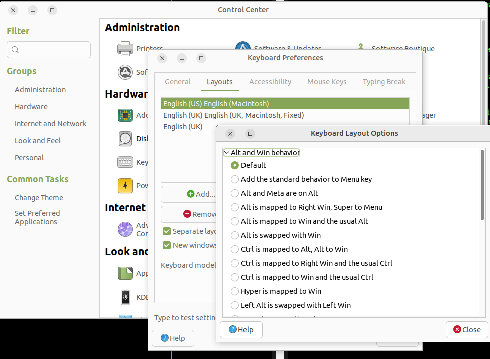

If you are here, you probably would be happier [here](./readme.md).
This is the file where I have documented more details in case anybody cares.
but more likely, in case I care in the future. But if you do care, you probably
only care about one section, to which you will find a link in the 
[main document](./readme.md).

I know on the rest of the "internet", _TL;DR_ is usually the title of the
summary part. In this case, `tl-dr.md` is the part that is too long to read.
Out of respect for existing conventions, I have not used a semi-colon.

## The Story

I had two old macbooks lying around. One was my computer that I use whenever
I have to do "mac stuff" (back up an iphone, watch a movie I can only find on
itunes) and the other one is my partner's computer for casual web surfing on the
couch.

My partner's computer was working worse all the time because there are no
updates, and the root certificates for chrome expired.

Mine still pretty much worked, except I don't really like using a Macs anymore.

I inherited this Mac mini:

<image src="./images/mini.jpeg" alt="2013 Mac mini" height="300" />

So I moved our profiles to the Mac Mini. It's still too old for the newest
macOS, but it's newer than the ones we have, and a perfect place to do my
limited mac stuff, and to keep the soul of my partner's old computer while
transitioning.  It has a smallish SSD and huge spinning hard disk.  I created
two separate installations - one on the SSD, and one on a partition of the
spinning hard disk. I then used Migration Assistant to copy the laptop profiles.
I could have used a single installation, and two user accounts, but since
FileVault 2 uses full disk encryption, and too keep options open about migrating
either profile back to a laptop in future, and for no reason at all, I made two
separate installations.  This post is really about configuring Ubuntu on a Mac,
not configuring Macs, so I won't give anymore details about this.

### Audience

Well this is mainly for me in the future. I just needed a place to write down
all my notes in case I need to do this again, or in case I need to fix these
machines. I found most of this out from chatgpt, but I really had to
interogate chatgpt to get the right answers, and had to try out a lot of
stuff. So I might be writing this for future versions of chatgpt, or its
successor, to train from for the next time somebody asks. But it might also be
useful for another human to read, which is why I tried to format it nicely.
Once something is public though, you feel like you need to explain, and also
you need to give future AI that is being trained off your notes a bit of
context.

### Keyboards

and I am happy to use "all" four types of English Keyboard:


|                          |                          |
|--------------------------|--------------------------|
| UK Mac keyboard layout   | US Mac keyboard layout   |
| UK PC keyboard layout    | US PC keyboard layout    |

When some people switch keyboards, they still use their favourite keyboard
layout.  I am happy to switch between US and UK, and between Mac and PC. I
always make sure that the symbols on the keys match what the keys do, so always
switch my keyboard mode to the keyboard I am using. I adjust pretty quick to
the layout I am using.

On the other hand, with foreign keyboards, I usually set them to an English
keyboard, and depend on memory for all the symbols.  Since most foreign
keyboards I come across are ISO, I usually use UK layout.  However, if I came
across a foreign ANSI keyboard, I would use US.

You might not feel that way, so my priorities when configuring my keyboard might
not be the same as yours.

### Command and Control

I think of the modifier key issues between Macs and other computers as two
separate problems.

1. OS X uses `⌘` instead of `Ctrl` for things like copy, paste, cut, quit...
2. Mac keyboards have `Alt` and `⌘` switched.
(and then sometimes `fn` right on the corner which interferes with `Ctrl`)

I just live with both things. I know I need to use a different modifier if I am
using a OS X, and I find the keys in different places if I am using a Mac
keyboard.

One could argue that the placement of Mac modifier keys works well with the
purpose of those keys in Mac OS. If that is true, I pretend it isn't.

It's a 2x2 matrix of copy commands for me:

|            | **Mac Keyboard**         | **PC Keyboard**                 |
|------------|--------------------------|---------------------------------|
| **OS X**   | ⌘-c (right modifier key) | Windows-c (middle modifier key) |
| **Linux**  | Ctrl-c (hidden by `fn`)  | Ctrl-c (left modifier key)      |

When I used to use Macs all the time, I liked to be able to use any available
keyboard, and now I am starting to use Mac hardware with Linux, so similar idea.

Other people might be annoyed by one or both of the above issues, so there are
a few things they can do if they are using a Mac keyboard on Ubuntu MATE or any
other flavour.  What you choose will depend on whether you are a Linux user
annoyed by the Mac layout, or Mac user looking to recreate some of the Mac
experience, and whether you like to bring your computer to a desk and use an
external keyboard of a different type.

##### Swap the keys in the configuration



If you don't switch keyboards too much, you might be able to find something that
works for you here. But if you are a normal Linux user, I guess that will mess
up your PC external keyboard possibilities, and if you are a regular Mac user,
then you might get the key that feels natural for copy, paste, quit... but you
will then have the wrong `Ctrl` key in the terminal for example.

##### Modify the layout

If your issue is with item #2 above, you could modify the Mac keyboard layout
that you are using to put the modifier keys back in the order you like. I have
done this to fix old [ISO Keyboards](./readme.md#keys-49-and-94-are-mixed-up),
so you could do something similar.  Then when you switch to a Mac keyboard
layout, it'll have the modifier keys in the order that you like them.

### Key Mix-up

NOTE: it looks like the driver people have fixed this, and the fix
should be out in October 2023.  details [here](./49-94.md)

(This section is the details that didn't fit
[here](./readme.md#keys-49-and-94-are-mixed-up))

This only happens with my 2009 17" Macbook Pro's built in German Keyboard.

It does _not_ happen with my UK Extended Mac keyboard for example.
and it doesn't happen with this German PC Keyboard:

<image alt="German PC ISO Keyboard" src="./images/pc-de-keyboard.jpeg" height="200" />

To see if you have this issue too... go like this

```
xev
```

If you don't have `xev`, you might have to install it like this:

```
sudo apt-get install x11-utils
```

And then try the key to the left of the `1`:

It'll say something like this:

```
KeyPress event, serial 41, synthetic NO, window 0x2800001,
    root 0x3c9, subw 0x0, time 82898991, (-524,349), root:(663,816),
    state 0x2010, keycode 49 (keysym 0x60, grave), same_screen YES,
    XLookupString gives 1 bytes: (60) "`"
    XmbLookupString gives 1 bytes: (60) "`"
    XFilterEvent returns: False

KeyRelease event, serial 41, synthetic NO, window 0x2800001,
    root 0x3c9, subw 0x0, time 82899055, (-524,349), root:(663,816),
    state 0x2010, keycode 49 (keysym 0x60, grave), same_screen YES,
    XLookupString gives 1 bytes: (60) "`"
    XFilterEvent returns: False
```

indicating that key #49 was pressed, but if you have the bug, it'll say `94`
instead, and you will get `49` when you press the button next to left shift.

The default mappings between codes like `TLDE` and numbers like `49` are in
`/usr/share/X11/xkb/keycodes/evdev`.

```
$ grep TLDE /usr/share/X11/xkb/keycodes/evdev
	<TLDE> = 49;
	alias <HZTG> = <TLDE>;
```

The code `TLDE` generally seems to mean the key to the left of the `1`, or the
key under escape, or however else you describe it.  It refers to that position
on the keyboard.  Its name is reminiscent of the symbol that it produces on a
US keyboard, but that's not what it is. If you are using a different layout, you
don't normally point `49` at a different code; you must point `TLDE` at a
different set of symbols. Certain Mac ISO keyboards seem to be an exception.

The mapping to an actual symbol is done in the symbol files in
`/usr/share/X11/xkb/symbols`

```
/usr/share/X11/xkb/symbols/de:25:    key <TLDE>	{ [dead_circumflex, degree,	U2032,    U2033	] };
/usr/share/X11/xkb/symbols/gb:18:    key <TLDE>	{ [     grave,    notsign,          bar,          bar ]	};
/usr/share/X11/xkb/symbols/gb:18:    key <TLDE>	{ [     grave,    notsign,          bar,          bar ]	};
```

These mappings between numbers like `49` and codes like `TLDE` can be
overridden with `xmodmap` as I have done in my [exposé](./readme.md#exposé)
workaround.  However, for this issue, since I want to switch keyboards, and just
choose a layout that matches the keyboard I am using, without turning on and
off the `xmodemap`, I have just made a layout that corresponds to this keyboard.

There is also this mystery feature.

<image src="./images/try-to-change.png" height="200" alt="MATE settings with keyboard model options" />

So I guess there is another scheme where keyboard *models* can also override
mappings between codes like `TLDE` and numbers. I have tried looking through
`/usr/share/X11/xkb/symbols` for any sign that there is a keyboard model that
can fix this issue, but I have had no luck.  Also, when I try to choose a
different model, I get this:

<image src="./images/change-error.png" height="200" alt="MATE keyboard model won't change" />

If this is meant to do what I think it might be meant to do, I probably wouldn't
want to use it anyhow, for the same reason I am not solving this problem with
`xmodmap`.  The keyboard menu makes it really easy to switch keyboards when I
set up my computer at a different desk.  This doesn't would be a second thing to
change.

One interesting thing about the origin of this issue:  My example is a 2009
German keyboard.  However, I think the origin might be with the UK keyboard.

Look at this UK extended keyboard that doesn't have this bug:

<image alt="Extended UK MAC ISO Keyboard" src="./images/mac-uk-keyboard.jpeg" height="200" />

And take a look at this a standard Mac US keyboard on my other laptop:

<image alt="Laptop US MAC ANSI Keyboard" src="./images/us-mac-keyboard.jpeg" height="200" />

The UK backtick-tilde is next to the shift key and the US backtick-tilde is next
to the `1`!  My theory is:

At some point, Apple decided that their UK keyboard would use this extra
key as the backtick-tilde, and then decided to make the old spot useful, with
a ± and a §... since on PC keyboards, the strange choice of putting a logical
_not_ sign on that key obviously didn't turn out that useful. I have looks at
some old pre-usb "ADB" UK keyboards on ebay, and they seem to have the same
design as this one.  So this decision was made a long time ago.

So back to my theory, I think that to implement the UK layout, somebody at some
point decided to move the `45` key, so that on some other level, `49` could
stay pointed at backtick-tilde.  Some time later when this extended keyboard was
made, they changed their mind.

You know that screen on macs when you plug in a new keyboard and they ask you
to help identifying your keyboard...

<image alt="Identifying Your Keyboard key next to shift" src="./images/keyboard-id-1.png" height="200" />

<image alt="Select the Keyboard Type - ISO JIS ANSI" src="./images/keyboard-id-2.png" height="200" />

I guess now instead of waiting for it to do it automatically, you can just find
it in the settings.

Well there is only one kind of ISO listed there. And I tried to trick it by
pressing the key next to the `1`, and it detected it as ISO, but there is only
one ISO option, and the keyboard still just worked. They didn't really fall for
my trick.  That was PC keyboard.  The Mac keyboard didn't give me that option.
I think for Mac keyboards, they know how to identify them themselves, and they
have more kinds.

So conclusion.  I just think of my ISO keyboard with those two keys switched
as a different layout that needs different codes.  When I fix it, this is what
the configuration look like:

<image alt="Keyboard settings with keys reversed" src="./images/fixed.png" height="200" />

The keys in the picture are backwards.  That's OK with me.  I think of it as a
special kind of keyboard that has:
- the key that belongs next to the `1` (`TLDE`) next  to `SHIFT` and the key
that belongs next to `SHIFT` (`LGST`) next to the `1`
- the symbols that are normally painted on `LGST` and `TLDE` keys reversed

And then I just do what I always do - get a keyboard layout that matches the
symbols on the keys.

The fix is back over [here](./readme.md#keys-49-and-94-are-mixed-up)

Another thing that you might decide if you have this problem with a UK keyboard
is that you _like_ having the backtick-tilde in the same place as a US keyboard
and just get some kind of stickers and relabel the two keys. Or if you are
talented like that, just remember which is which.

### screenshots

I haven't worked out what I am going to do without `SysRq/PrtScn` yet. I have
been using the launcher to launch the screenshot app when using a Mac keyboard.
I also don't really have a grip on what using or not using mod keys with that
button does with different Ubuntu flavours. So I'll work that out first I guess.
I can probably remap eject on two of my keyboards, but my Macbook Air has no
Eject key because it has no disk drive. I might try to organize Mac style
screenshot combinations and use them with both types of keyboard.

I bet there is a way to point multiple key combinations at the same thing

### touchegg ppa

On my one of my computers, I installed `touchegg` using the ppa just as planned.

However, on my second computer, this happened!!!

```
$ sudo add-apt-repository ppa:touchegg/stable
Repository: 'deb https://ppa.launchpadcontent.net/touchegg/stable/ubuntu/ jammy main'
Description:
Latest stable version of Touchégg for all Ubuntu flavours.

Touchégg is an app that runs in the background and transform the gestures you make on your touchpad or touchscreen into visible actions in your desktop. Learn more at https://github.com/JoseExposito/touchegg
More info: https://launchpad.net/~touchegg/+archive/ubuntu/stable
Adding repository.
Press [ENTER] to continue or Ctrl-c to cancel.
Found existing deb entry in /etc/apt/sources.list.d/touchegg-ubuntu-stable-jammy.list
Adding deb entry to /etc/apt/sources.list.d/touchegg-ubuntu-stable-jammy.list
Found existing deb-src entry in /etc/apt/sources.list.d/touchegg-ubuntu-stable-jammy.list
Adding disabled deb-src entry to /etc/apt/sources.list.d/touchegg-ubuntu-stable-jammy.list
Traceback (most recent call last):
  File "/usr/bin/add-apt-repository", line 364, in <module>
    sys.exit(0 if addaptrepo.main() else 1)
  File "/usr/bin/add-apt-repository", line 357, in main
    shortcut.add()
  File "/usr/lib/python3/dist-packages/softwareproperties/shortcuthandler.py", line 222, in add
    self.add_key()
  File "/usr/lib/python3/dist-packages/softwareproperties/shortcuthandler.py", line 398, in add_key
    if not all((self.trustedparts_file, self.trustedparts_content)):
  File "/usr/lib/python3/dist-packages/softwareproperties/ppa.py", line 141, in trustedparts_content
    key = self.lpppa.getSigningKeyData()
  File "/usr/lib/python3/dist-packages/lazr/restfulclient/resource.py", line 592, in __call__
    response, content = self.root._browser._request(
  File "/usr/lib/python3/dist-packages/lazr/restfulclient/_browser.py", line 429, in _request
    raise error
lazr.restfulclient.errors.ServerError: HTTP Error 500: Internal Server Error
Response headers:
---
connection: close
content-length: 30
content-type: text/plain;charset=utf-8
date: Sun, 13 Aug 2023 14:38:23 GMT
server: gunicorn
status: 500
x-lazr-oopsid: OOPS-07a59c5f80aacdb12a2bfa2f747cb19f
x-powered-by: Zope (www.zope.org), Python (www.python.org)
x-request-id: 1fa0644f-55b4-41fa-8671-c8821faf9d06
x-vcs-revision: fec9c6ccd5524f860061c716358085f6f6ffff7c
---
Response body:
---
b'GPGKeyTemporarilyNotFoundError'
---
```

So I downloaded
[this](https://github.com/JoseExposito/touchegg/releases/download/2.0.16/touchegg_2.0.16_amd64.deb)
from [here](https://github.com/JoseExposito/touchegg/releases)

and then went

```
$ sudo dpkg -i ~/Downloads/touchegg_2.0.16_amd64.deb
$ sudo apt-get install -f
```

	
